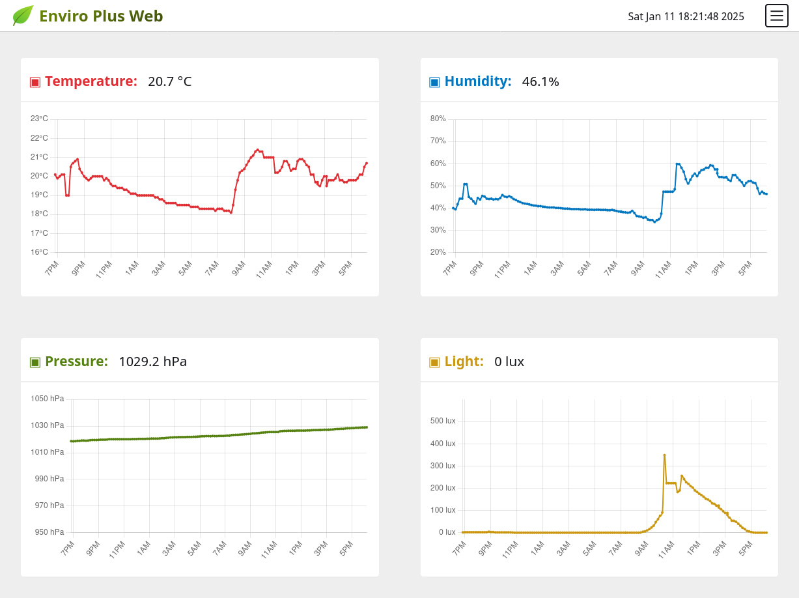
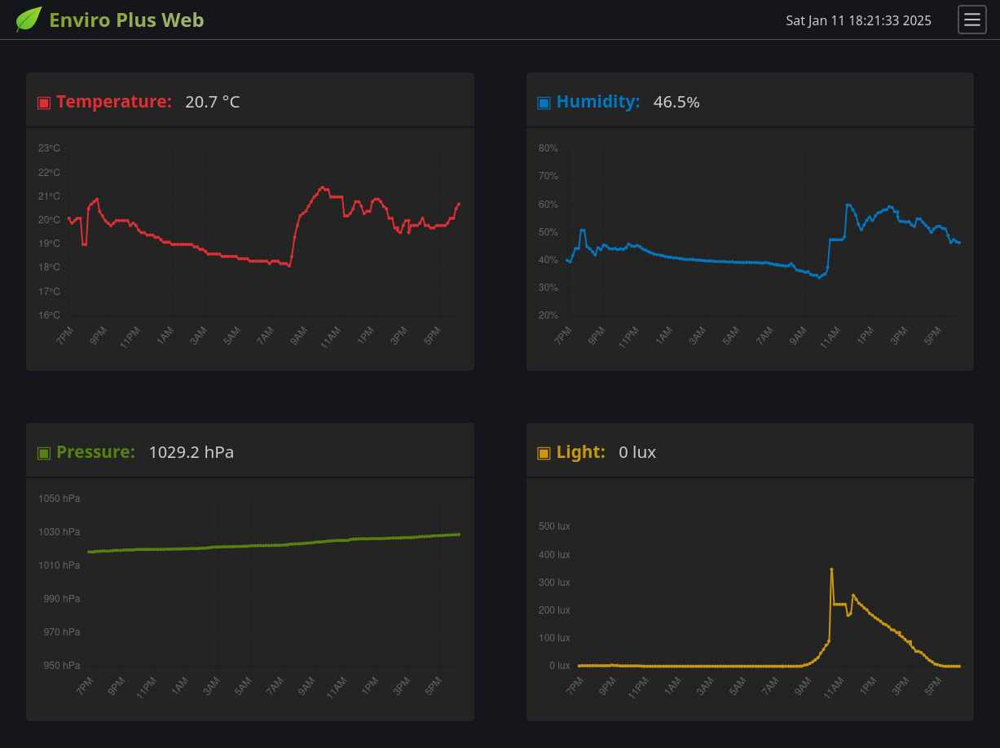

# 🌿 Enviro Plus Web

Web interface for [Enviro](https://shop.pimoroni.com/products/enviro?variant=31155658489939) and [Enviro+](https://shop.pimoroni.com/products/enviro?variant=31155658457171) sensor board plugged into a Raspberry Pi.  
This simple webapp serves a page with the current sensor readings in a graph over a specified time period.  
Runs thanks to [Flask](https://flask.palletsprojects.com) and [Chart.js](https://www.chartjs.org/)





⚠️ Enviro readings must not be relied upon for critical applications.

## 📋 Table of contents

- [🌿 Enviro Plus Web](#-enviro-plus-web)
  - [📋 Table of contents](#-table-of-contents)
  - [📖 User guide](#-user-guide)
    - [Raspberry Pi OS Bookworm](#raspberry-pi-os-bookworm)
    - [Raspberry Pi OS Bullseye (legacy)](#raspberry-pi-os-bullseye-legacy)
  - [🚀 Improve me](#-improve-me)
  - [⚖️ License](#️-license)
  - [💬 FAQ](#-faq)

## 📖 User guide

Choose the tutorial that matches your Raspberry Pi OS:

### Raspberry Pi OS Bookworm

[Installation and setup for Bookworm](./docs/enviroplusweb-install-bookworm.md)

### Raspberry Pi OS Bullseye (legacy)

[Installation and setup for Bullseye](./docs/enviroplusweb-install-bullseye.md)

## 🚀 Improve me

Feel free to add your features and improvements.

## ⚖️ License

GNU Affero General Public License v3.0

## 💬 FAQ

- ### Where are my data readings saved?

  Your data will be stored in the same place where you have the application, in JSON format inside a folder called `/enviroplusweb-data`.

- ### How can I get my Raspberry Pi IP?

  Enter `hostname -I` in a Terminal window on your Raspberry Pi, then you will see the IPv4 and the IPv6.

- ### Graphs are empty, they don't draw any lines, but the live readings on the header are displayed

  You need to wait to have some data recorded in your Raspberry Pi. If you just run the app for first time, give it some time to save a few readings (~30min).

- ### I have updated from a version prior to 4.x.x and now I cannot see my previous readings on the graph

  Version 4 brings a major change in file reading and management. These changes mean that readings from old versions are not taken into account due to their different file name format and JSON structure.  

  However, there is a fix, which requires two actions:
  1. Renaming the reading files
  2. Editing the files format/content

  First step:  
  Access to the folder where you have the readings (by default `/enviroplusweb-data`). You will see that the files have the following file name: YEAR-0xx (eg: 2025-034)  

  You need to change the file name, including the month and day it belongs to. For example, if the file 2025-034 has the readings for 14th April 2025, then the file should be renamed as: 2025-04-14.json  

  Second step:  
  Edit each JSON file and add the character `[` at the beginning of the file. Do the same thing, including the character `]` at the end of the file. To finish, just add a comma `,` at the end of each line/reading in the list, which is after the character `}` (remember that the last reading doesn't need a comma).  
  
  Once done, you can reboot your Raspberry Pi and the old readings will appear in your graphs.

- ### Raspberry Pi is running other services at localhost

  You can change the port to avoid any conflict with other applications. In that case edit the file `config.py` and find this line:

  ```python
  HOST_PORT = 8080
  ```

  Just change the `HOST_PORT` for another number (for example `4567`) and run again the app. Now you can access to your EnviroPlusWeb typing the ip address followed by `:4567`

- ### Enviro Plus Web is running but I can't connect to the web server through my browser

  If running your app, you can see in the terminal or in the log file the following message:

  ```terminal
  * Serving Flask app 'enviroplusweb'
  * Debug mode: off
  Permission denied
  ```

  This problem may be due to `port=80` not being available to be used by the application and you have to use another port.

- ### I want to run my EnviroPlusWeb under HTTPS

  By default you use HTTP to connect to your Raspberry Pi through your browser, but some browsers will redirect automatically to HTTPS. If you prefer to have your project running under HTTPS here you have a tutorial explaning how to setup Flask with HTTPS:  
  <https://blog.miguelgrinberg.com/post/running-your-flask-application-over-https>

- ### Sometimes my Raspberry Pi disconnects from the wifi and I can't connect again

  There is an option that manages the power of the wifi and allows to put it in saving mode. Disabling this option may help you to avoid this problem. First check if the wifi power save feature is enabled or not:

  ```terminal
  iw wlan0 get power_save
  ```

  If it is enabled, then edit the following file. Remember to replace in the path your HOSTNAME (if your default hostname is not 'pi'):

  ```terminal
  sudo nano /home/pi/.bashrc
  ```

  And add the following line at the end:

  ```terminal
  sudo iwconfig wlan0 power off
  ```

  Reboot and check again typing the first command to see if the feature is enabled or not.

